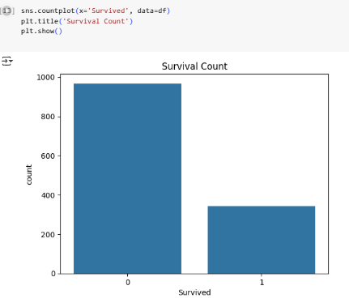
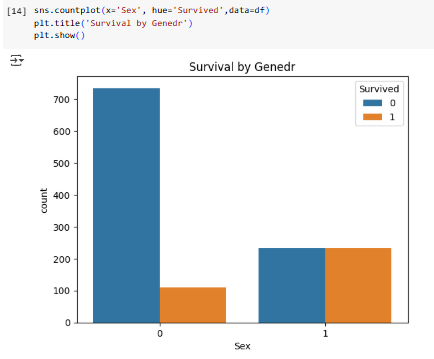
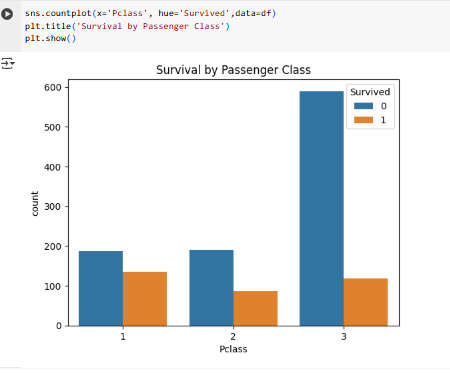

# Titanic-EDA-Project
# Task 1 – Exploratory Data Analysis (EDA) on Titanic Dataset

## Objective:
To perform exploratory data analysis on the Titanic dataset and identify important patterns and relationships, especially in terms of survival.

## Dataset:
The dataset contains information about Titanic passengers such as:
- Passenger ID
- Age
- Fare
- Sex
- SibSp (Siblings/Spouses aboard)
- Parch (Parents/Children aboard)
- Pclass (Passenger class)
- Embarked
- Survived (Target variable)

## Steps Followed:
1. Loaded and explored the dataset
2. Removed unnecessary columns and fixed column names
3. Handled missing values (none in this case)
4. Created visualizations to explore relationships in the data

## Visualizations:
### Survival Count

### Survival by Gender

### Correlation Heatmap

## Observations:
- More males died, more females survived.
- 1st class passengers had better survival rates.
- Socioeconomic status and gender affected survival chances.

## How to Run:
Open the Titanic_EDA.ipynb file in Jupyter Notebook or Google Colab. Run each cell step-by-step to see the visualizations and insights.
